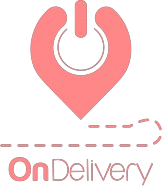

# 🚚 ONDelivery

<div align="center">
  
  
  **Plataforma de Delivery Multiempresa**
  
  [](https://reactjs.org/)
  [](https://firebase.google.com/)
  [](https://mui.com/)
  [](https://vitejs.dev/)
</div>

---

## 📋 Descripción

ONDelivery es una aplicación de delivery completa inspirada en **Ridery**, diseñada para gestionar servicios de delivery multiempresa. Permite que múltiples restaurantes gestionen sus pedidos con repartidores dedicados, todo desde una plataforma centralizada.

### 🎯 Características Principales

| Característica | Descripción |
|----------------|-------------|
| 🗺️ **GPS Tiempo Real** | Seguimiento en vivo de repartidores con actualización cada 5-10 segundos |
| 💬 **Chat en Tiempo Real** | Comunicación directa restaurante ↔ repartidor |
| ⭐ **Sistema de Calificaciones** | Evaluación de 1-5 estrellas con comentarios y promedios automáticos |
| 🔔 **Notificaciones Push** | Alertas automáticas en cada cambio de estado del servicio |
| 🌙 **Modo Oscuro** | Interfaz moderna con tema oscuro por defecto |
| 📱 **PWA** | Instalable como aplicación nativa en móviles |

---

## 🏗️ Arquitectura

```
┌─────────────────────────────────────────────────────────────┐
│                    ONDelivery Frontend                       │
│                   (React + Material UI)                      │
└─────────────────────────────────────────────────────────────┘
                              │
                              ▼
┌─────────────────────────────────────────────────────────────┐
│                    Firebase Services                         │
├─────────────────────────────────────────────────────────────┤
│  📦 Firestore      │  Base de datos principal               │
│  🔄 Realtime DB    │  Chat y ubicación en tiempo real       │
│  🔐 Authentication │  Gestión de usuarios y roles           │
│  📤 Storage        │  Imágenes y archivos                   │
│  🔔 Cloud Messaging│  Notificaciones push                   │
└─────────────────────────────────────────────────────────────┘
                              │
                              ▼
┌─────────────────────────────────────────────────────────────┐
│                    Netlify (Hosting)                         │
│  🌐 Static Site    │  Frontend optimizado                   │
│  ⚡ Functions      │  Backend serverless                    │
└─────────────────────────────────────────────────────────────┘
```

---

## 👥 Roles de Usuario

| Rol | Descripción | Dashboard |
|-----|-------------|-----------|
| 🔴 **Admin** | Administrador general del sistema | Gestión completa: usuarios, restaurantes, repartidores, reportes |
| 🟢 **Restaurante** | Comercios asociados | Gestión de pedidos, menú, historial, liquidaciones |
| 🔵 **Repartidor** | Conductores de entrega | Pedidos asignados, navegación GPS, historial de entregas |

---

## 🚀 Inicio Rápido

### Prerrequisitos

- Node.js 18+ instalado
- Cuenta de Firebase (plan Spark gratuito o superior)
- Cuenta de Netlify (para despliegue)

### Instalación Local

```bash
# 1. Clonar el repositorio
git clone https://github.com/tu-usuario/ondelivery.git
cd ondelivery

# 2. Instalar dependencias
npm install

# 3. Configurar variables de entorno
cp .env.example .env.local
# Edita .env.local con tus credenciales de Firebase

# 4. Iniciar servidor de desarrollo
npm run dev
```

La aplicación estará disponible en `http://localhost:5173`

---

## ⚙️ Configuración de Firebase

### Paso 1: Crear Proyecto Firebase

1. Ve a [Firebase Console](https://console.firebase.google.com/)
2. Clic en "Añadir proyecto"
3. Nombre del proyecto: `ondelivery` (o el que prefieras)
4. Desactiva Google Analytics (opcional para desarrollo)
5. Clic en "Crear proyecto"

### Paso 2: Habilitar Servicios

#### Authentication
```
Firebase Console > Authentication > Comenzar
```
- Habilitar: Email/Password, Google

#### Firestore Database
```
Firebase Console > Firestore Database > Crear base de datos
```
- Modo: Producción (configurar reglas después)
- Ubicación: us-central1 (o la más cercana)

#### Realtime Database
```
Firebase Console > Realtime Database > Crear base de datos
```
- Necesario para chat y tracking en tiempo real

#### Storage
```
Firebase Console > Storage > Comenzar
```
- Reglas: Solo usuarios autenticados

### Paso 3: Obtener Credenciales

```
Firebase Console > Configuración del proyecto > Tus aplicaciones
```

1. Añade una web app (`</>` icono)
2. Copia la configuración a tu `.env.local`

### Paso 4: Configurar Reglas

Ver archivos `firestore.rules` para las reglas de seguridad recomendadas.

---

## 🌐 Despliegue en Netlify

### Opción A: Conexión GitHub (Recomendado)

1. Sube el código a GitHub
2. Ve a [Netlify](https://app.netlify.com/)
3. "Add new site" > "Import an existing project"
4. Conecta tu repositorio
5. Configura:
   - Build command: `npm run build`
   - Publish directory: `dist`
6. Añade las variables de entorno
7. Deploy

### Opción B: CLI

```bash
# Instalar Netlify CLI
npm install -g netlify-cli

# Login
netlify login

# Inicializar proyecto
netlify init

# Desplegar
netlify deploy --prod
```

---

## 📁 Estructura del Proyecto

```
ondelivery/
├── public/                 # Archivos estáticos
│   ├── logo.png           # Logo principal
│   ├── manifest.json      # PWA manifest
│   └── firebase-messaging-sw.js
├── src/
│   ├── components/        # Componentes React
│   │   ├── chat/         # Sistema de chat
│   │   ├── rating/       # Sistema de calificaciones
│   │   ├── tracking/     # GPS tracking
│   │   └── ui/           # Componentes UI base
│   ├── pages/            # Páginas por rol
│   │   ├── admin/
│   │   ├── restaurante/
│   │   └── repartidor/
│   ├── services/         # Servicios Firebase
│   ├── hooks/            # Custom hooks
│   ├── store/            # Estado global (Zustand)
│   └── theme/            # Tema Material UI
├── netlify/
│   └── functions/        # Serverless functions
├── .env.example          # Variables de entorno ejemplo
├── netlify.toml          # Configuración Netlify
└── vite.config.js        # Configuración Vite
```

---

## 🔧 Scripts Disponibles

| Comando | Descripción |
|---------|-------------|
| `npm run dev` | Servidor de desarrollo |
| `npm run build` | Build de producción |
| `npm run preview` | Preview del build |
| `npm run netlify` | Netlify Dev local |

---

## 🔐 Variables de Entorno

| Variable | Descripción | Requerido |
|----------|-------------|-----------|
| `VITE_FIREBASE_API_KEY` | API Key de Firebase | ✅ |
| `VITE_FIREBASE_AUTH_DOMAIN` | Dominio de autenticación | ✅ |
| `VITE_FIREBASE_PROJECT_ID` | ID del proyecto | ✅ |
| `VITE_FIREBASE_DATABASE_URL` | URL de Realtime Database | ✅ |
| `VITE_FIREBASE_STORAGE_BUCKET` | Bucket de Storage | ✅ |
| `VITE_FIREBASE_VAPID_KEY` | VAPID Key para Push | ✅ |
| `FIREBASE_SERVICE_ACCOUNT` | Service Account JSON | Netlify |

---

## 📱 Funcionalidades por Rol

### 🔴 Administrador
- Dashboard con métricas en tiempo real
- Gestión de restaurantes y repartidores
- Asignación de zonas
- Reportes y análisis
- Liquidaciones y pagos
- Configuración de tarifas

### 🟢 Restaurante
- Dashboard de pedidos
- Gestión de menú
- Historial de servicios
- Chat con repartidores
- Perfil y configuración
- Calificaciones recibidas

### 🔵 Repartidor
- Lista de servicios asignados
- Navegación GPS integrada
- Actualización de estado en tiempo real
- Historial de entregas
- Chat con restaurantes
- Perfil y estadísticas

---

## 🛡️ Seguridad

- Autenticación Firebase con múltiples proveedores
- Reglas de seguridad Firestore/Storage
- Validación de datos en frontend y backend
- Variables de entorno para credenciales sensibles
- HTTPS obligatorio en producción

---

## 📊 Tecnologías

| Categoría | Tecnología |
|-----------|------------|
| Frontend | React 18, Vite, Material UI 5 |
| Estado | Zustand |
| Backend | Firebase, Netlify Functions |
| Base de datos | Firestore, Realtime Database |
| Mapas | Leaflet, OpenStreetMap |
| Notificaciones | Firebase Cloud Messaging |
| Hosting | Netlify |

---

## 📄 Licencia

Este proyecto está bajo la Licencia MIT. Ver archivo `LICENSE` para más detalles.

---

## 👨‍💻 Autor

Desarrollado con ❤️ para la comunidad de delivery.

---

<div align="center">
  <sub>ONDelivery © 2024 - Inspirado en Ridery Venezuela</sub>
</div>
